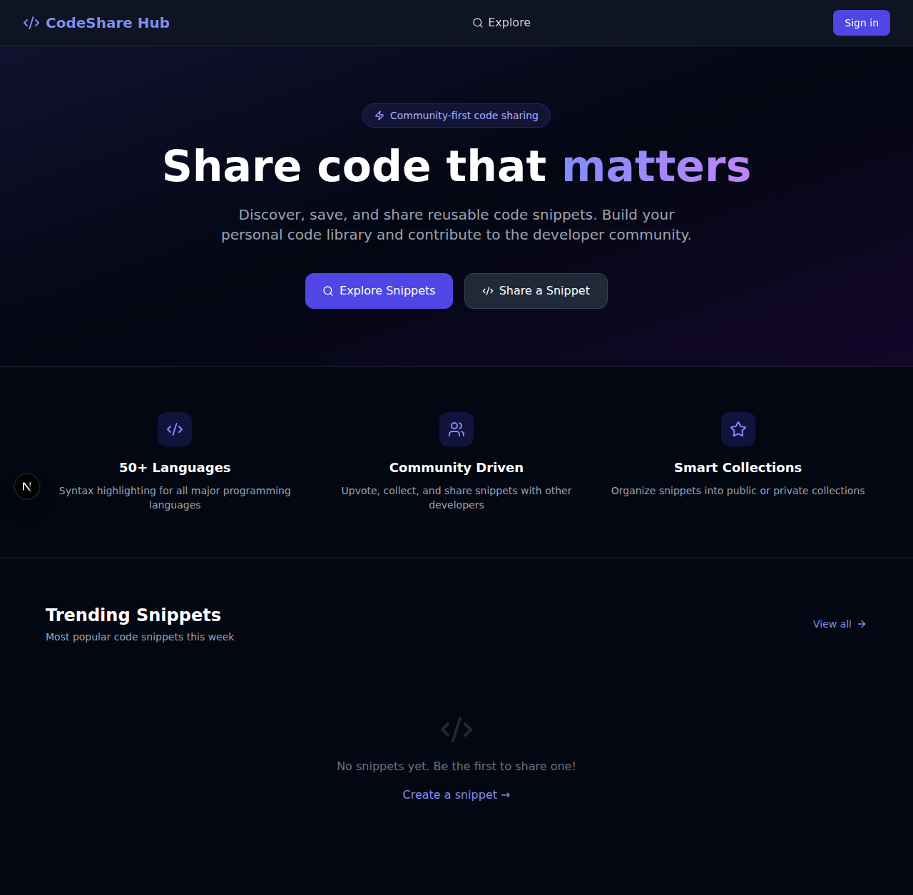
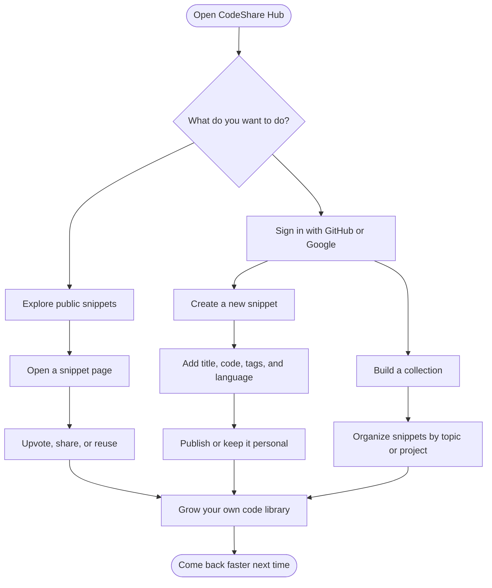

# CodeShare Hub

<p align="center">
  
</p>

<p align="center">
  
</p>

<p align="center">
  <a href="https://nextjs.org"></a>
  <a href="https://react.dev"></a>
  <a href="https://www.typescriptlang.org"></a>
  <a href="https://tailwindcss.com"></a>
  <a href="https://www.mongodb.com"></a>
  <a href="https://vercel.com"></a>
</p>

<p align="center">
  CodeShare Hub is a friendly place to <strong>save</strong>, <strong>organize</strong>, and <strong>share</strong> useful code snippets.<br />
  It helps developers keep good code close, so they can reuse it, improve it, and help others faster.
</p>

---

## ✨ Quick look

<p align="center">
  
</p>

### Why this feels useful

- Save snippets before they get lost in old chats, notes, or random files.
- Search and explore shared code in one clean place.
- Group snippets into collections when a project grows.
- Sign in with GitHub or Google and start quickly.
- Share code in a clean format with syntax highlighting, vibrant cards, and smooth motion.

---

## 🧭 Interactive product flow



> Tip: On GitHub, Mermaid diagrams stay interactive enough to expand, zoom, and make the project flow easier to scan.

---

## 🛠️ Tech stack with icons

<p align="center">
  
</p>

| Layer | Tools |
| --- | --- |
| Frontend | Next.js App Router, React 18, TypeScript |
| Styling | Tailwind CSS with layered gradients and glassmorphism-inspired panels |
| Auth | NextAuth.js with GitHub and Google sign-in |
| Data | MongoDB + Mongoose |
| UI touches | Lucide React, Framer Motion, React Syntax Highlighter |
| Deployment fit | Vercel |

---

## 🌟 Main features

- **Fast sharing** — create a snippet with title, code, tags, and language.
- **Clean reading** — syntax highlighting makes snippets easy to scan.
- **Community feel** — explore public snippets, vote, and share links.
- **Collections** — keep related snippets together.
- **Simple profile pages** — see your own shared work in one place.
- **Modern auth** — sign in with providers people already use.
- **Colorful landing experience** — gradients, glowing surfaces, and motion make the homepage feel more lively.

---

## 🎨 Updated visual direction

- **Tailwind CSS** powers the refreshed gradients, glass panels, spacing, and colorful dark theme.
- **Framer Motion** adds soft motion to navigation and snippet cards for a smoother feel.
- **Lucide React** keeps icons crisp and consistent across feature highlights and calls to action.
- The refreshed homepage is designed to feel more animated and welcoming while staying readable for developers.

---

## 🚀 Run it locally

### 1) Install dependencies

```bash
npm install
```

### 2) Add your environment variables

Copy the example file and fill in your real values:

```bash
cp .env.example .env.local
```

| Variable | What it is for |
| --- | --- |
| `MONGODB_URI` | MongoDB connection string |
| `NEXTAUTH_URL` | App URL, usually `http://localhost:3000` in local work |
| `NEXTAUTH_SECRET` | Secret used by NextAuth |
| `GITHUB_CLIENT_ID` / `GITHUB_CLIENT_SECRET` | GitHub login |
| `GOOGLE_CLIENT_ID` / `GOOGLE_CLIENT_SECRET` | Google login |

### 3) Start the app

```bash
npm run dev
```

Open [http://localhost:3000](http://localhost:3000)

### 4) Validate it

```bash
npm run lint
npm run build
```

---

## ▲ Deploy

### Why not GitHub Pages?

GitHub Pages is best for static sites. CodeShare Hub is **not** a static-only project because it uses:

- Next.js server features
- API routes
- NextAuth authentication
- MongoDB data access

That means **Vercel is the right fit here**.

### One-click Vercel deploy

[](https://vercel.com/new/clone?repository-url=https://github.com/aniruddhaadak80/codeshare-hub)

### Vercel setup notes

1. Import this repository into Vercel.
2. Add the same environment variables from `.env.example`.
3. Set `NEXTAUTH_URL` to your deployed Vercel domain.
4. Deploy.

This repository now includes a small `vercel.json` file so the project is clearly marked as a Next.js deployment target.

---

## 🔎 Discovery topics

These are the **20 exact topics** prepared for repository discovery and also mirrored in `package.json` keywords:

`codeshare` · `code-snippets` · `snippet-manager` · `nextjs` · `react` · `typescript` · `tailwindcss` · `mongodb` · `mongoose` · `nextauth` · `oauth` · `developer-tools` · `syntax-highlighting` · `app-router` · `full-stack` · `web-app` · `open-source` · `vercel-ready` · `productivity` · `community-platform`

> If you want these to appear as GitHub repository topics in the repo header, add the same 20 words in the GitHub repository **About** settings.

---

## 💡 In simple words

CodeShare Hub helps you stop losing useful code.

Instead of digging through old files or chat messages, you can keep your best snippets in one calm place, give them tags, put them in collections, and share them when someone needs help.

---

## 🤝 Contributing

If you want to improve the project, feel free to fork it, build something nice, and open a pull request.

---

## 📄 License

This project is open source and available under the license used by this repository.
